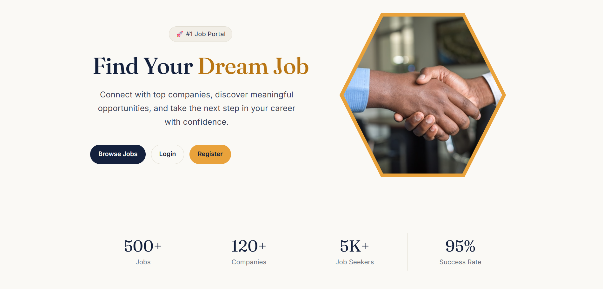
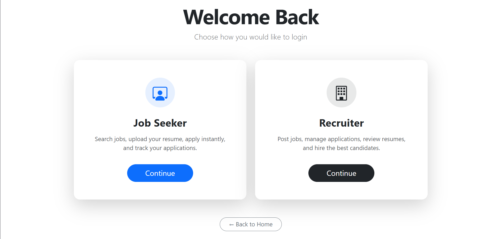
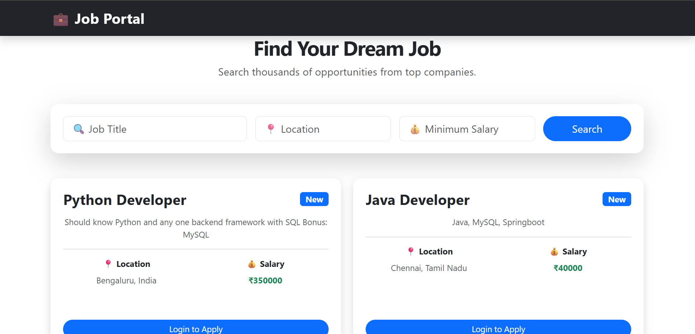
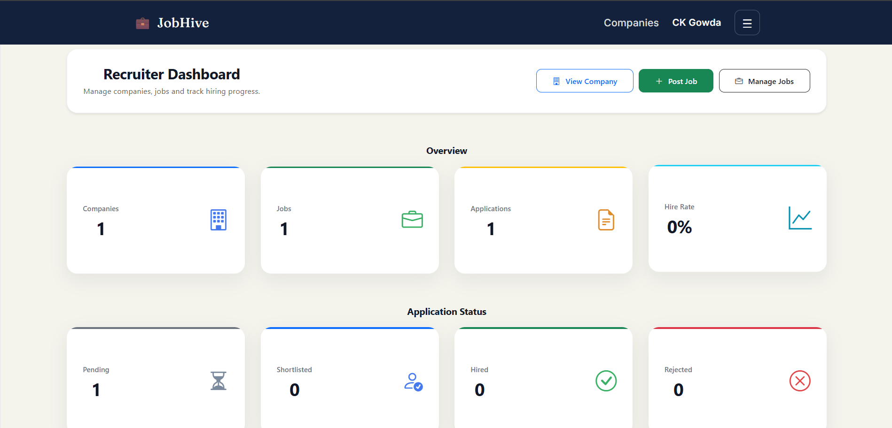
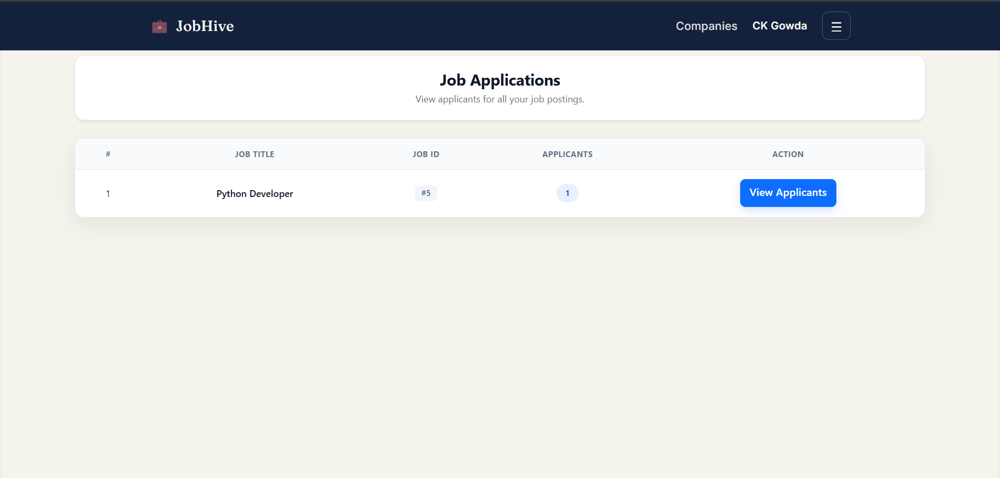
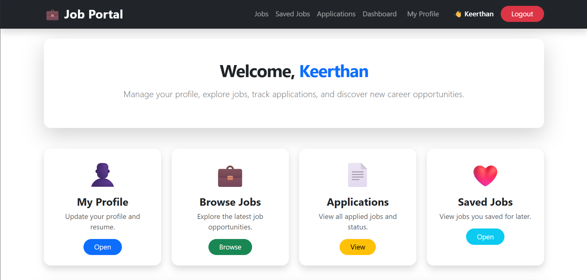
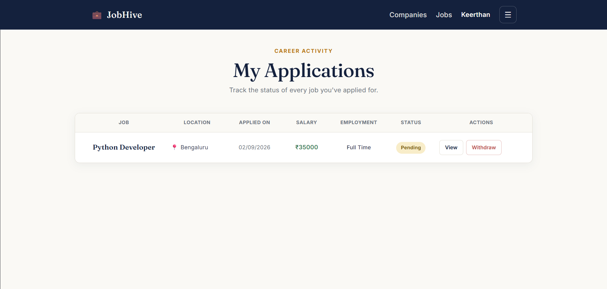

# Job Portal – Full Stack Web Application

A full-stack Job Portal application built with **FastAPI, React.js, and PostgreSQL**. The platform enables recruiters to create and manage job postings while allowing job seekers to search, apply, save jobs, upload resumes, and track applications through a secure role-based system.

---

# 🌐 Live Demo

Deployment: https://jobhive-job-portal.vercel.app/

---

# 📂 GitHub Repository

https://github.com/keerthan-gowda-c/Fastapi_Job_portal

---

# 📸 Screenshots

## Home Page


## Login Page


## Jobs Page


## Recruiter Dashboard


## Recruiter Job Applications


## Jobseeker Dashboard


## Jobseeker Applications


---

# 🚀 Features

## Authentication & Authorization

- JWT-based authentication
- Role-based access control (Recruiter & Job Seeker)
- Secure password hashing
- Protected API endpoints

---

## Job Management

- Create, update, delete, and view job postings
- Search and filter jobs
- View detailed job information

---

## Company Management

- Recruiters can create and manage company profiles
- Complete CRUD operations for companies

---

## Job Applications

- Apply for jobs
- Track submitted applications
- Recruiters can review applicants

---

## Recruiter Dashboard

- View total jobs posted
- View application statistics
- Hiring analytics and insights

---

## Jobseeker Features

- Resume upload
- Save jobs
- Track applied jobs

---

## API Documentation

- Interactive Swagger UI documentation

---

# 🛠️ Tech Stack

## Frontend

- React.js
- Vite
- JavaScript
- HTML5
- CSS3
- Bootstrap
- Axios

---

## Backend

- FastAPI
- SQLAlchemy
- Pydantic
- JWT Authentication
- Alembic
- Uvicorn

---

## Database

- PostgreSQL

---

## Deployment & DevOps

- Docker
- Docker Compose
- AWS EC2 (Planned)

---

## Tools

- Git
- GitHub
- VS Code
- Swagger UI

---

# 📁 Project Structure

```text
Fastapi_Job_Portal/
│
├── Backend/
│   ├── app/
│   ├── Dockerfile
│   ├── requirements.txt
│   ├── .dockerignore
│   └── ...
│
├── Frontend/
│   ├── src/
│   ├── Dockerfile
│   ├── package.json
│   ├── .dockerignore
│   └── ...
│
├── docker-compose.yml
└── README.md
```

---

# ⚙️ Installation

## Clone Repository

```bash
git clone https://github.com/keerthan-gowda-c/Fastapi_Job_portal.git

cd Fastapi_Job_Portal
```

---

# Backend Setup

```bash
cd Backend

python -m venv virt

virt\Scripts\activate

pip install -r requirements.txt
```

Create a `.env` file inside the **Backend** folder:

```env
APP_NAME=Job Portal

SECRET_KEY=your_secret_key

ALGORITHM=HS256

ACCESS_TOKEN_EXPIRE_MINUTES=30

DATABASE_URL=your_database_url
```

Run backend server:

```bash
uvicorn app.main:app --reload
```

Backend will run at:

```
http://localhost:8000
```

---

# Frontend Setup

```bash
cd Frontend

npm install

npm run dev
```

Frontend will run at:

```
http://localhost:5173
```

---

# 🐳 Docker Setup

## Build and Start Containers

```bash
docker compose up
```

## Run Containers in Background

```bash
docker compose up -d
```

## Rebuild Images

```bash
docker compose up --build
```

## Stop Containers

```bash
docker compose down
```

---

# 📖 API Documentation

FastAPI provides interactive API documentation.

Open:

```
http://localhost:8000/docs
```

Swagger UI allows testing and exploring all available API endpoints.

---

# 🔐 Authentication Flow

The application uses JWT authentication:

1. User registers and logs in.
2. Backend validates credentials.
3. Passwords are securely hashed.
4. JWT access token is generated.
5. Token is used for protected API requests.

---

# 🗄️ Database Design

The application manages:

- Users
- Companies
- Jobs
- Applications
- Saved Jobs

PostgreSQL is used for reliable data storage with SQLAlchemy ORM and Alembic migrations.

---

# 🔮 Future Enhancements

- Deploy on AWS EC2
- Configure Nginx Reverse Proxy
- Implement CI/CD Pipeline
- Email Notifications
- Interview Scheduling
- Advanced Job Recommendations

---

# 👨‍💻 Author

**Keerthan Gowda C**

GitHub:
https://github.com/keerthan-gowda-c

LinkedIn:
https://www.linkedin.com/in/keerthan-gowda-c/

---

# 📄 License

This project is created for learning, portfolio, and demonstration purposes.